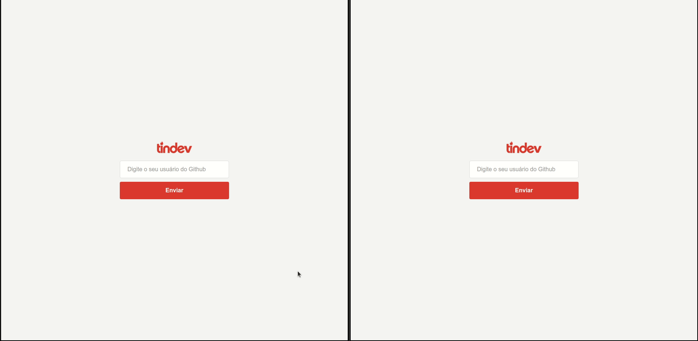

# Tindev

<p align="center">

</p>

Basically a toy system where developers can find each other using the github id. Uses websocket to provide realtime matching. The system is composed by a backend, a mobile and a web app, all using the JS Stack (NodeJS, React and ReactNative).



## Requirements

This application uses MongoDB.

## How to install

```
git clone https://github.com/lucas8107/tindev-JS-Stack
```

On each project folder run the following command:

```
npm install
npm start
```

To install the mobile app, use either: 

```
npx react-native run-android
```

or

```
npx react-native run-ios
```